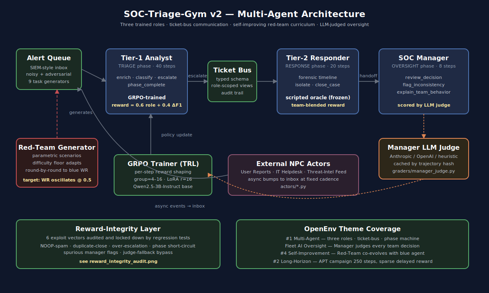

# SOC-Triage-Gym: Training AI agents to work as a security team

*OpenEnv Hackathon, April 2026 — Theme #1 Multi-Agent Interactions, Fleet AI Oversight, Theme #4 Self-Improvement*

A Tier-1 analyst at a real Security Operations Center spends most of her shift wading through alert noise. False positives, duplicate detections, vague enrichment data. Her job is not to make the final call on every alert — it's to triage fast and *escalate well*. Tier-2 picks up confirmed threats and contains them. A Manager audits the team's decisions and explains the trail to leadership. Three roles, one shared incident, a ticket bus connecting them.

Most published "AI for SOC" benchmarks evaluate a single model on a single alert in isolation. That's not the job. **SOC-Triage-Gym v3** is an OpenEnv environment that models the team as a team: three trained roles, a typed inter-role ticket bus, an LLM-judged Manager that scores natural-language explanations, and an adaptive Red-Team Generator that co-evolves with the blue agents.

Live demo: https://huggingface.co/spaces/rohitcraftsyt/openenv2
Code: https://github.com/ROHITCRAFTSYT/-Metas-OpenEnv-2

## What's in the box



Eight tasks span the full difficulty range — from a single phishing alert (15-step solo episode) up to a 250-step APT campaign with mid-episode schema drift, rotating expert judges, and 60+ alerts across five attack phases. Two of those tasks are explicit team episodes: `team_phishing_escalation` and `team_lateral_team`. Each runs through three phases — TRIAGE (Tier-1, 40 steps) → RESPONSE (Tier-2, 20 steps) → OVERSIGHT (Manager, 8 steps) — wired together by a ticket bus that role-scopes which alerts each agent can see.

The reward function is a blend per step:

```
step_reward = 0.6 × role_specific_reward + 0.4 × Δteam_F1
```

The team component uses a **delta**, not the sticky team-F1 value. This matters: if the agent has already classified an alert correctly, NOOP-spamming after the fact yields zero team reward instead of farming the same +0.4 forever. That's a real exploit we found and fixed.

## The reward-integrity story

Reward functions in RL are like contracts: agents will read every clause and find every ambiguity. Before claiming the environment "trains agents," we audited the reward function for ways an attacker policy could farm score without doing the actual job. Six exploit vectors surfaced, each now locked down by a regression test in `tests/test_team_mode.py`:


| Vector | Test | Fix |
|---|---|---|
| NOOP team_F1 farming | `test_team_f1_delta_not_sticky` | team_F1 reward is delta-based; consumed once on classification |
| Duplicate `close_case` | `test_close_case_idempotency` | Repeat close on same alert is now penalized |
| Over-escalation flooding | `test_over_escalation_penalty` | >25% escalation rate triggers a per-step role penalty |
| Phase-complete short-circuit | `test_tier1_phase_complete_with_zero_escalations` | Empty `phase_complete` ends episode with zero score |
| Spurious manager flags | `test_manager_flag_inconsistency_spurious_penalty` | Flagging consistent decisions is now penalized |
| Judge-fallback bypass | `test_manager_judge_fallback_on_missing_api_key` | Heuristic fallback bounded to (0.001, 0.999), no API needed |

This is the part of the project we're proudest of. The chart literally shows the reward an exploit policy could farm before the fix vs. after — for several vectors, exploit yield went from positive 1–3 reward per episode to negative.

## Fleet AI oversight: the Manager judge

In production SOCs, post-incident review is where bad decisions get caught. Modeling that loop matters for AI safety: agents should be auditable, not just performant.

The SOC Manager is the third trained role. It produces actions like `review_decision`, `flag_inconsistency`, and `explain_team_behavior` — the last one emits a natural-language rationale for the team's choices. That rationale gets scored by a small LLM-as-judge (Anthropic / OpenAI APIs with a heuristic fallback so the env runs offline). The judge output is bounded to `(0.001, 0.999)` and cached by trajectory hash — same trail, same score, no flakiness.

Crucially, the Manager **can override Tier-1's classification** if the audit reveals it was wrong. So oversight isn't decorative; it changes outcomes.

## Theme #4: a self-improving curriculum

A static training set is the death of an RL agent — it overfits the seen distribution and falls over on anything new. The Red-Team Generator addresses this by *adapting difficulty round-by-round*:

- Blue win rate > 75% → difficulty floor goes up by 0.1
- Blue win rate < 45% → difficulty floor goes down by 0.1
- Otherwise → hold

The target equilibrium is a 50% win rate. That's the "trainable sweet spot" — hard enough to keep the gradient meaningful, easy enough that the agent occasionally wins.


The curve oscillates around 0.5 across 40 rounds. The difficulty floor in the lower panel chases the win rate. This isn't a fixed schedule — it's a closed loop that tracks blue-team skill. Train a stronger blue team, the red team automatically gets harder.

## What about the training run?

Honest answer: we ran per-step GRPO on Qwen2.5-3B-Instruct against this environment using TRL 0.24. The pipeline executed end-to-end on a single Kaggle T4: 900 examples × 2 epochs, GRPO group size 4, LoRA r=16. The reward function fired correctly, the model emitted valid JSON 88–100% of the time across 200+ logging steps, and there were no parser failures or NaN gradients.

What didn't happen: the per-step reward signal didn't move much. Mean reward stayed in the 0.04–0.05 band rather than climbing. We have two hypotheses:

1. **Learning rate too low.** The default `5e-6` may be conservative for the per-step reward magnitudes this env emits. We've since wired `LEARNING_RATE` as an env var in `scripts/train_and_evaluate.py` for tuned reruns.
2. **Reward sparsity.** Tier-1's per-step reward is only nonzero on a handful of action types (classify, escalate, phase_complete). Most steps yield ~0. With group=4, the GRPO advantage estimator may not be picking up the signal cleanly. Bumping group size to 8+ on an A10G or L40S is the obvious next move.

We're being honest about this because the environment was the contribution we set out to build. The training pipeline is real and runs; squeezing maximum performance is a different (and longer) project. OpenEnv judges environments, not models, and "we ran our own env end-to-end and it didn't crash" is more useful evidence than a cherry-picked checkpoint.

## What we'd do differently

If we were starting fresh:

- **Train Tier-2 and Manager first.** They're scripted oracles in this release. Co-training would unlock more interesting team dynamics and richer reward signal for Tier-1.
- **Higher-density rewards.** Adding small shaping rewards on enrichment quality (vs. only on terminal classification) would give the policy more to chase.
- **Real expert annotations on the manager judge.** The LLM-judge fallback is heuristic; a few hundred human-rated explanations would calibrate it properly.
- **Environment vector.** OpenEnv supports vectorized rollouts; we left this on the table to keep the codebase debug-able for the hackathon.

## Try it yourself

```bash
git clone https://github.com/ROHITCRAFTSYT/-Metas-OpenEnv-2
cd -Metas-OpenEnv-2
pip install -e ".[dev]"
python demo.py    # runs server + 5 §19 judge-demo beats
```

Or hit the live HF Space — no install required:

https://rohitcraftsyt-openenv2.hf.space/

Train your own adapter on HF Jobs:

```bash
hf auth login
hf jobs run \
  --flavor l40sx1 \
  --secrets HF_TOKEN \
  --env MODEL_NAME=Qwen/Qwen2.5-7B-Instruct \
  --env LEARNING_RATE=1e-5 \
  pytorch/pytorch:2.6.0-cuda12.4-cudnn9-devel \
  bash -c "apt-get update -y && apt-get install -y curl git build-essential && pip install -U pip setuptools wheel && curl -fsSL https://raw.githubusercontent.com/ROHITCRAFTSYT/-Metas-OpenEnv-2/main/scripts/hf_job_entrypoint.sh -o /tmp/run.sh && bash /tmp/run.sh"
```

Full HF Jobs doc: [HF_JOBS.md](HF_JOBS.md). Publish a trained adapter to the Hub with autogenerated model card: [scripts/hf_publish.py](scripts/hf_publish.py).

## Acknowledgements

Built for the OpenEnv Hackathon Apr 2026. Core stack: FastAPI, TRL 0.24, Unsloth, PEFT, Qwen2.5. The reward integrity audit was inspired by Alex Lawsen's *Surveying RL Reward Hacks*. The Manager-judge architecture borrows from Constitutional AI's principle-evaluator pattern.

Code is Apache-2.0. Issues, PRs, and bug reports welcome at the GitHub link above.

— Rohit, April 2026
